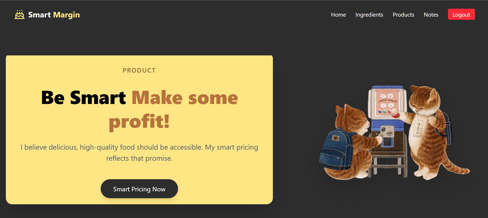

-->
[![Contributors][contributors-shield]][GENREAL ASEEMPLY & SDA]
[![LinkedIn][linkedin-shield]][https://www.linkedin.com/in/rana-ahmed-864bb41b7?utm_source=share&utm_campaign=share_via&utm_content=profile&utm_medium=ios_app ]

<!-- PROJECT LOGO -->
 

  

<h3 align="center">SmartMargin frontend</h3>

  

   **Smart Margin** is a platform designed for business owners — such as bakeries and coffee shops — to calculate the true cost of their products, set profitable prices, and ensure customer satisfaction without losses. It works like a personal business journal where you can securely store your product prices, write notes, and manage your ideas — all privately, with access only to you.
     
    <a href="https://github.com/ranaahmd/smartmargin-frontend/tree/main"><strong>Explore the docs »</strong></a>
     
     

<!-- TABLE OF CONTENTS -->

  
Table of Contents

  <ol>
    <li>
      <a href="#about-the-project">About The Project</a>
      <ul>
        <li><a href="#built-with">Built With</a></li>
      </ul>
    </li>
    <li>
      <a href="#getting-started">Getting Started</a>
      <ul>
        <li><a href="#prerequisites">Prerequisites</a></li>
        <li><a href="#installation">Installation</a></li>
      </ul>
    </li>
    <li><a href="#usage">Usage</a></li>
    <li><a href="#roadmap">Roadmap</a></li>
    <li><a href="#contributing">Contributing</a></li>
    <li><a href="#contact">Contact</a></li>
    <li><a href="#acknowledgments">Acknowledgments</a></li>
  </ol>

<!-- ABOUT THE PROJECT -->
## About The Project

[![Product Name Screen Shot][product-screenshot]]()

(<a href="#readme-top">back to top</a>)

### Built With

* [![React][React.js]][https://react.dev/]
* [![Javascript][Javascript]][https://nodejs.org/en]
* [![docker][docker]][https://www.docker.com/]
* [![Django][Django]][https://www.djangoproject.com/]
* [![DjangoRestFramework][DjangoRestFramework]][https://www.djangoproject.com/]
* [![Python][Python]][https://www.python.org/]
* [![PostgreSQL][PostgreSQL]][https://www.postgresql.org/]
* [![css][Tailwind.css]][https://tailwindcss.com/]

(<a href="#readme-top">back to top</a>)

<!-- GETTING STARTED -->
## Getting Started

To get a local copy up and running follow these simple example steps.

### Prerequisites

Make sure you have the following installed:

Node.js
 (v18 or higher)

npm (comes with Node)

### Start Development Server

To start the local development server, run:
npm run dev

Then open http://localhost:5173
 in your browser.

 ### Installation

Get a free API Key
Sign up or generate your API key from https://example.com

Clone the repository
git clone https://github.com/ranaahmd/smartmargin-frontend/tree/main
cd smartmargin-frontend

### Install dependencies

npm install

Set up Tailwind CSS
If Tailwind isn’t already configured, install and initialize it:

npm install -D tailwindcss postcss autoprefixer
npx tailwindcss init -p

Then update your tailwind.config.js file:

content: [
  "./index.html",
  "./src/**/*.{js,ts,jsx,tsx}",
],
theme: {
  extend: {},
},
plugins: [],

And include Tailwind in your src/index.css (or src/main.css):

@tailwind base;
@tailwind components;
@tailwind utilities;

### Configure your API key
Create a .env file in the project root and add your key:

VITE_API_KEY=ENTER_YOUR_API_KEY

Change Git remote URL
To prevent pushing to the original base project:

git remote set-url (https://github.com/ranaahmd/smartmargin-frontend/tree/main )
git remote -v   # confirm the changes

(<a href="#readme-top">back to top</a>)

<!-- USAGE EXAMPLES -->
## Usage
💡 Usage

Smart Margin helps small business owners — like bakeries, coffee shops, and home-based brands — calculate their product costs, set fair prices, and keep track of profits without losing money.

Add your ingredients or products 🧁
Enter the name, unit, and cost per unit — Smart Margin will handle the math for you.

Calculate your true cost 💰
Combine ingredients to see the total cost per product — no more guessing or losing profit.

Set your perfect price 🎯
Use the smart margin calculator to find a selling price that satisfies your customer and ensures your profit.

Save your notes & data privately 🔒
Write down ideas, recipes, or business notes — only you can see them.

Grow smarter, not harder 🚀
Track your numbers, adjust prices, and make data-driven decisions to keep your business thriving.

(<a href="#readme-top">back to top</a>)

## 🛠️ Tech Stack

**Frontend:**
- React.js – UI library for building dynamic interfaces  
- Vite – Fast development environment and bundler  
- Tailwind CSS – Utility-first CSS framework for styling  

**Backend:**
- Django (Django REST Framework) – For API and data management  

**Database:**
- SQLite / PostgreSQL – To store product, cost, and user data  

**Other Tools:**
- Axios – For API requests  
- Lucide React – For clean and modern icons  
- AOS – For smooth scroll animations
-Docker 
### Backend Repo Link
HERE YOU CAN FIND RHE LINK TO smartmargin-backend 

(<a href="#readme-top">back to top</a>)

## 🌍 Link to Deployed Site
🚧 Coming soon! Stay tuned for the live version of Smart Margin.

## IceBox Features
These are planned features I’d love to add in future versions:
- 📊 **Dashboard Analytics** — visual charts showing profit trends, top-selling products, and cost breakdowns.  
- 💾 **Data Export** — export your cost and pricing data to Excel or PDF for easy sharing.  
- 🧾 **Invoice Generator** — automatically create printable product cost sheets or invoices.  
- 📱 **Mobile-Friendly Mode** — optimized layout for easier access on phones and tablets.  
- 🔔 **Smart Alerts** — notifications when product costs change or margins drop.  
- 👥 **Multi-User Access** — invite team members to manage products collaboratively.

### appreciated

If you have a suggestion that would make this better, please fork the repo and create a pull request. You can also simply open an issue with the tag "enhancement".
Don't forget to give the project a star! Thanks again!

1. Fork the Project
2. Create your Feature Branch (`git checkout -b feature/AmazingFeature`)
3. Commit your Changes (`git commit -m 'Add some AmazingFeature'`)
4. Push to the Branch (`git push origin feature/AmazingFeature`)
5. Open a Pull Request

(<a href="#readme-top">back to top</a>)

<!-- ACKNOWLEDGMENTS -->
## Acknowledgments
Special thanks to everyone who contributed to the learning journey behind this project:

* Saudi Digital Academy (SDA)

* Instructor Conor Hamilton — for his insightful guidance, technical mentorship, and encouragement throughout the program.

* Instructor George Jones — for his practical advice, problem-solving mindset, and inspiring teaching style.
* Instructor Asti — for her practical advice, problem-solving mindset, and inspiring teaching style.

(<a href="#readme-top">back to top</a>)

